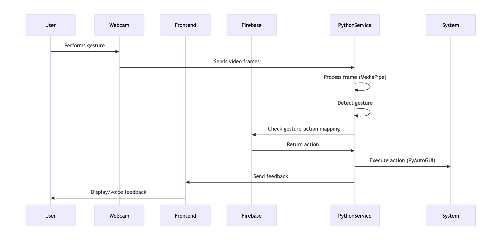

<div align="center">

# HandsFree OS - Gesture-Controlled Accessibility Interface


An innovative assistive technology that enables computer control through hand gestures, designed for differently-abled users and hands-free interaction.

 <!-- Add a demo gif later -->

<p align="center">
  
</p>
</div>


## 🌟 Key Features

- **Gesture Recognition**: Control your computer with intuitive hand motions
- **Voice Feedback**: Audio confirmation of recognized gestures
- **Customizable Mappings**: Train your own gestures for specific actions
- **Cross-Platform**: Works on Windows, macOS, and Linux
- **Webcam-Based**: No special hardware required
- **Open Source**: Free and adaptable to individual needs


## 🛠️ Technology Stack

### 💻 Frontend
<p align="left">
  
  
</p>

- **React.js** – Component-based UI development
- **Tailwind CSS** – Utility-first modern styling
- **Firebase Authentication** – Secure and scalable user authentication
- **WebSocket** – Real-time bi-directional communication

---

### 🧠 Backend
<p align="left">
  
  
  
  
</p>

- **Python 3.7+** – Core backend scripting
- **MediaPipe** – Real-time hand tracking
- **PyAutoGUI** – Programmatic system control
- **Socket.IO** – Real-time communication bridge


## 🚀 Installation Guide

### Prerequisites
- Node.js 16+
- Python 3.7+
- Webcam
- Firebase project (for authentication)

### 1. Frontend Setup
```bash
cd frontend
npm install
cp .env.example .env  # Update with your Firebase config
npm start
```

### 2. Python Backend Setup
```bash
cd gesture-detection
pip install -r requirements.txt
python -m gesture_detection.main
```

### 3. Firebase Setup
```bash
Create a Firebase project at firebase.google.com
Enable Google Authentication
Update .env file with your Firebase config
```

### 4. Running the Application
```bash
# Start Python Service (in one terminal):
cd gesture-detection && python -m gesture_detection.main

# Start React Frontend (in another terminal):
cd frontend && npm start
```

## ✋ Default Gestures

| Gesture       | Action             |
|---------------|--------------------|
| ✋ Open Palm   | Show Desktop       |
| 👍 Thumbs Up   | Volume Up          |
| 👎 Thumbs Down | Volume Down        |
| 👌 OK Sign     | Play/Pause Media   |
| ➡️ Swipe Right | Next Tab           |
| ⬅️ Swipe Left  | Previous Tab       |


## Project Structure
```bash
handsfree-os/
├── frontend/               # React application
├── gesture-detection/      # Python gesture service
│   ├── actions/            # System control modules
│   ├── hand_landmarks/     # Gesture processing
│   ├── utils/              # Helper functions
│   └── main.py             # Main service entry
└── docs/                   # Documentation
```


## 🤝 Contributing
We welcome contributions! Please follow these steps:

Fork the repository

Create your feature branch (git checkout -b feature/AmazingFeature)

Commit your changes (git commit -m 'Add some amazing feature')

Push to the branch (git push origin feature/AmazingFeature)

Open a Pull Request


## ✉️ Contact
- Project Maintainer: Arsh Tiwari 
- Mail : arshtiwari12345@gmail.com

### Project Link: The frontend is currently hosted at [HandsFree OS](https://hands-free-os.vercel.app/login).


